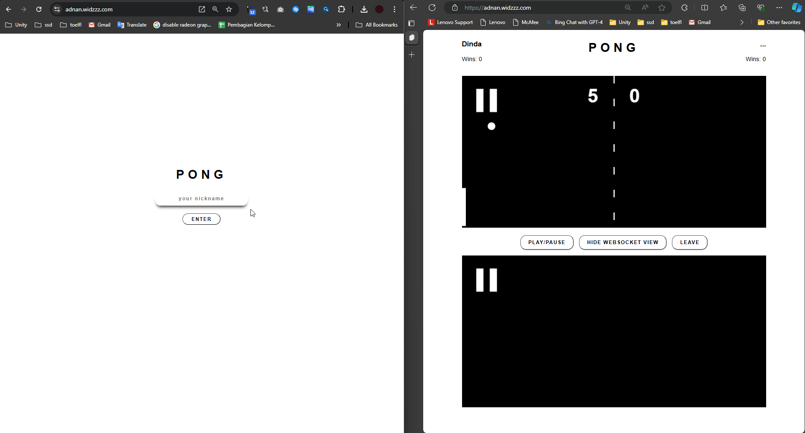
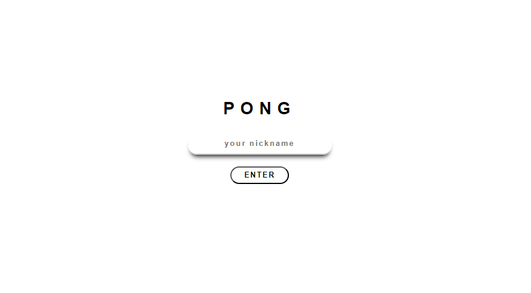
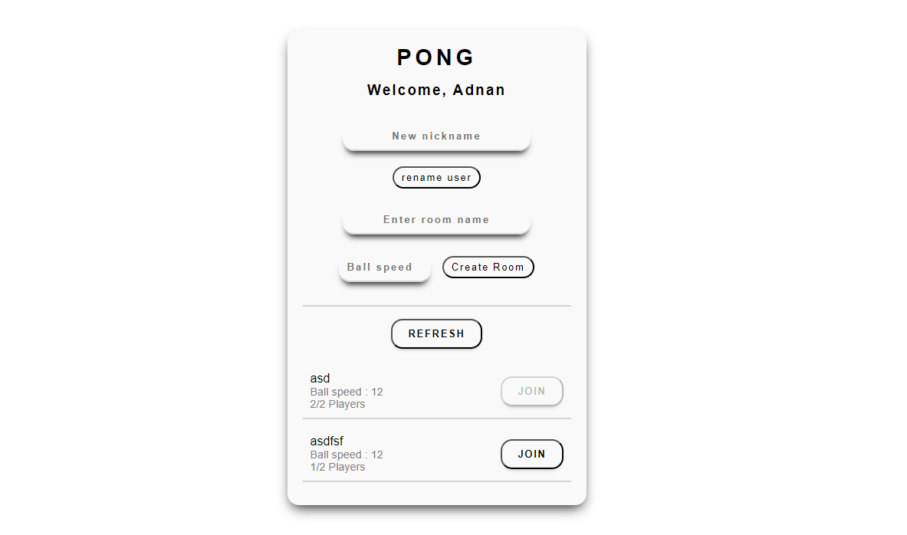

# Pong Multiplayer Online

You can play the game online at [adnan.widzzz.com](https://adnan.widzzz.com).


The web game is based on the classic "Pong" game and was built using Python with technologies like Sveltekit, Starlette, Uvicorn, and asyncio. It supports both HTTP/2 and HTTP/3 protocols. A key feature of the game is its use of WebTransport for gamestate communication, instead of more traditional methods like WebSocket or UDP sockets. Additionally, the game serves as a comparison tool, allowing users to observe the differences between WebSocket and WebTransport in real-time.

### Features

- Auto reconnection and disconnection handling: The game automatically handles reconnection and disconnection scenarios to ensure a seamless experience.
- Simple login: Users can easily log in to the game using only nickname, the user is saved in the browser
- Change nickname: Players have the option to change their nickname.
- Create custom room: Users can create their game room with custom name and ball speed.
- Play/pause: The game allows players to control the game state by pausing or resuming the gameplay.
- Leave room: Players can leave the current game room whenever they want.

## Technologies Used

- [SvelteKit](https://kit.svelte.dev/)
- [Python 3.11](https://www.python.org/downloads/release/python-3119/)
- [Starlette](https://www.starlette.io/)
- [asyncio](https://docs.python.org/3/library/asyncio.html)
- [aioquic](https://aioquic.readthedocs.io/en/latest/)
- [Uvicorn](https://www.uvicorn.org/)
- [WebTransport](https://web.dev/webtransport/)

## Screenshots

### Login Screen


### Game Room


### Room List


## Installation

To run the game locally, follow these steps:

1. Clone the repository:

```bash
git clone https://github.com/your-username/pong-multiplayer-online.git
```

2. Install the required dependencies:

```bash
pip install -r requirements.txt
```

3. Start the game server:

```bash
python http_server.py
```

4. Open your web browser and navigate to `https://{your local ip address here}` to play the game.

## How to Play

- Set nickname
- Create or join a room
- Play the game (2 players are required for the game to start)

## License

This project is licensed under the MIT License. See the [LICENSE](LICENSE) file for more information.
